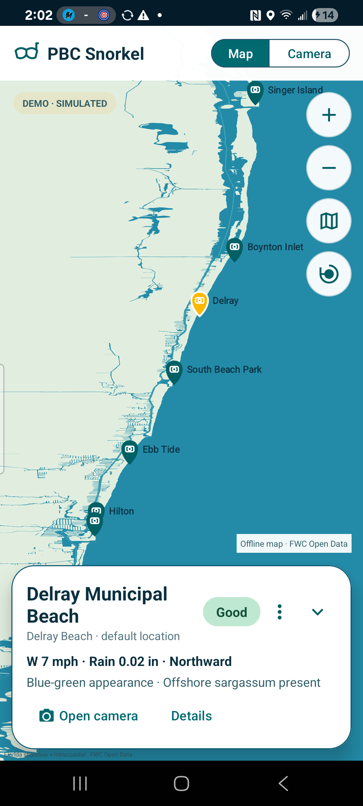
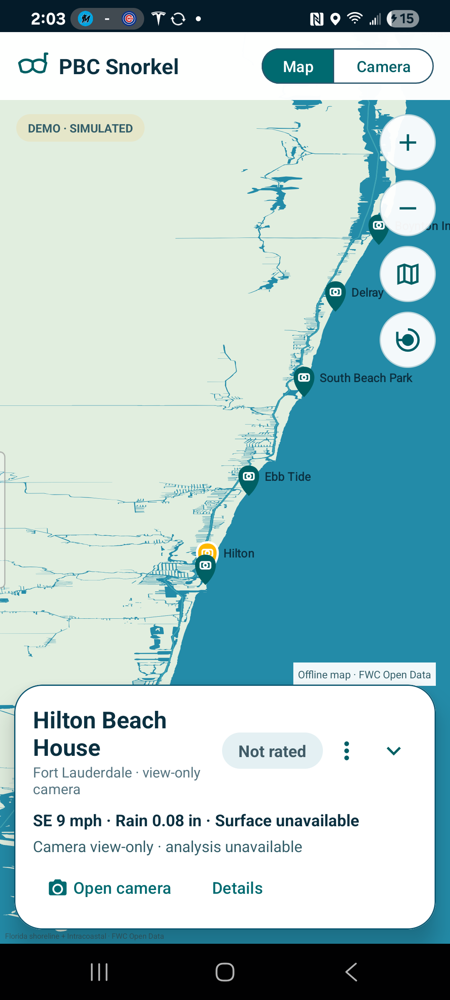

# PBC Snorkel V2 map visual preview

All displayed conditions are clearly labeled simulated visual-preview scenarios. No live rating rules or Boynton transport adjustment are implemented.

## Original GUI reference alongside revised Android preview

<table>
<tr><th>Original PBC GUI mockup</th><th>Revised Android V2 map — compact Delray</th></tr>
<tr><td></td><td></td></tr>
</table>

## Final bounded-map review

| Delray — compact | Hilton — view-only |
|---|---|
|  |  |

The navigation recording is [v2-map-navigation.mp4](v2-map-navigation.mp4). It demonstrates north/south panning, zoom controls, camera selection, bounded recentering, and panel expansion.

The offline background uses bundled, simplified Florida Fish and Wildlife Conservation Commission shoreline and Intracoastal Waterway Open Data, clipped with overscan from Miami-Dade through northern Palm Beach County. Camera pins and sourced shapes share the same WGS84 projection, and bounded pan/zoom prevents exposing the extract edges. It requires no network or third-party map tiles. The map displays FWC attribution in-app and is not intended for navigation. Jupiter remains conditional on verification of a useful beach-facing view.
