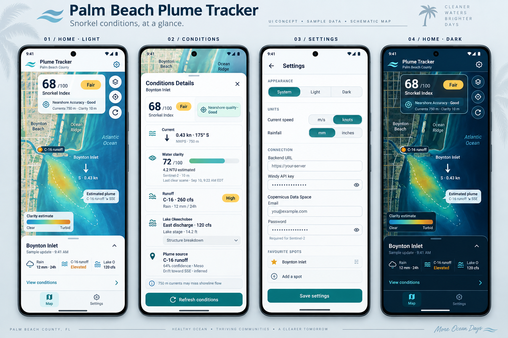
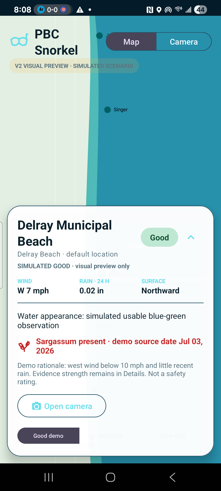
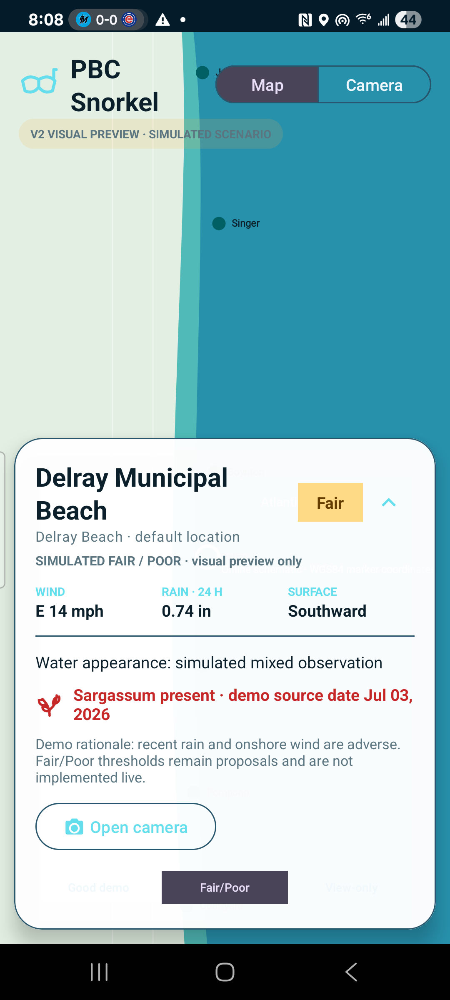
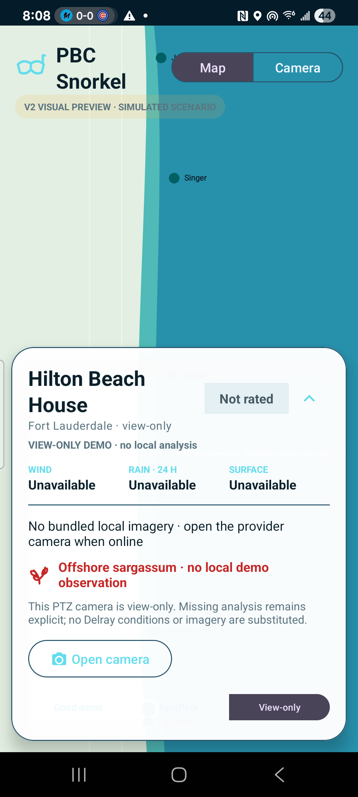

# PBC Snorkel V2 map visual preview

All displayed conditions are clearly labeled simulated visual-preview scenarios. No live rating rules or Boynton transport adjustment are implemented.

## Original GUI reference alongside Android implementation

<table>
<tr><th>Original PBC GUI mockup</th><th>Android V2 map preview — Delray simulated Good</th></tr>
<tr><td></td><td></td></tr>
</table>

## Required scenarios

| Delray — simulated Good | Delray — simulated Fair/Poor | Broward view-only |
|---|---|---|
|  |  |  |

The offline background is intentionally identified as a schematic rather than a conventional tile basemap. Marker positions are projected from the reviewed WGS84 coordinates and require no network or third-party map tiles. Jupiter remains labeled as a beach-facing view that must be verified before live integration.
