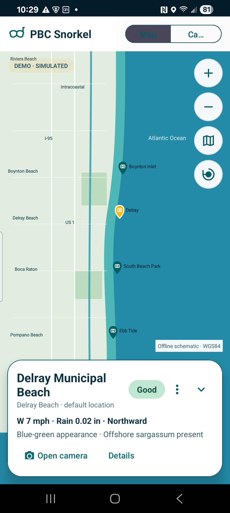
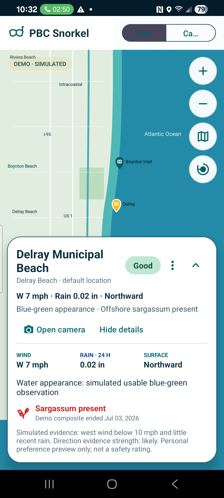
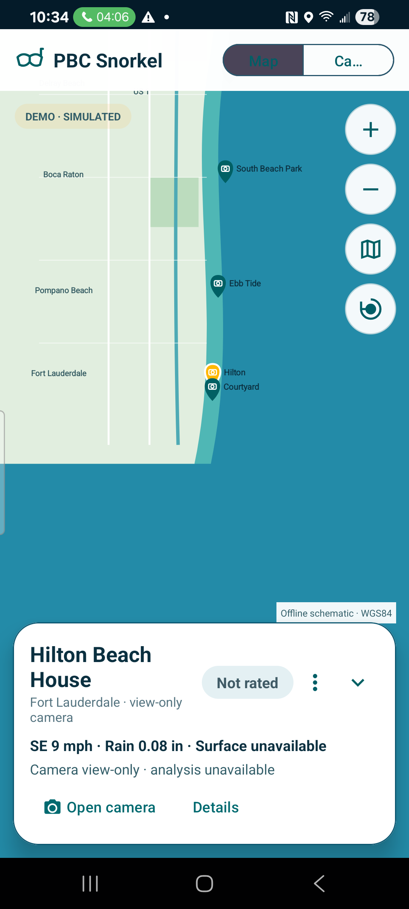

# PBC Snorkel V2 map visual preview

All displayed conditions are clearly labeled simulated visual-preview scenarios. No live rating rules or Boynton transport adjustment are implemented.

## Original GUI reference alongside revised Android preview

<table>
<tr><th>Original PBC GUI mockup</th><th>Revised Android V2 map — compact Delray</th></tr>
<tr><td></td><td></td></tr>
</table>

## Revised review states

| Delray — compact | Delray — expanded Details | Hilton — view-only |
|---|---|---|
|  |  |  |

The offline background remains explicitly identified as a schematic. It now includes a recognizable southeast Florida coastline, municipalities, the Intracoastal Waterway, I-95, US 1, park areas, and camera pins projected from the reviewed WGS84 coordinates. It requires no network or third-party map tiles. Jupiter remains conditional on verification of a useful beach-facing view.
